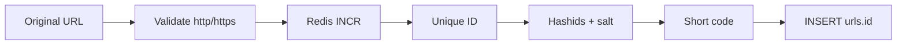

# URL Shortener

A Go CLI that shortens URLs. Redis issues a unique numeric ID to avoid collisions under concurrency. That ID is encoded with Hashids + salt and the resulting short code is stored as `urls.id`. Uniqueness never depends on checking whether a code already exists.

## Flow



`urls.id` is the short code. Redis never writes to Postgres; it only allocates the next integer. Hashids encodes that `uint64` directly — there is no Base62 step.

## Layout

```
cmd/shortener/      CLI (Cobra) and composition root
internal/urls/      domain: validate, encode, persist
internal/idgen/     Redis INCR — unique uint64, nothing else
internal/hashid/    uint64 ↔ short code (Hashids + HASHIDS_SALT)
internal/postgres/  connection pool
migrations/         golang-migrate SQL
```

`cmd/shortener` wires the process: it opens a Postgres pool, dials Redis through `idgen`, and builds `urls.Service`. Redis is owned by `idgen`. Postgres is owned by the URL repository. Neither package knows about the other.

## Why this design

Random short codes need a `SELECT` (is this taken?) plus a retry on collision. That check-then-act is a race, gets worse as the namespace fills, and turns the database into a uniqueness oracle — a bad shape for a critical write path.

Here Redis `INCR` issues a unique `uint64`. Encoding is deterministic, so two IDs cannot produce the same code. Create is increment, encode, insert. No existence query, no retry.

Hashids + `HASHIDS_SALT` also hide sequence. Encoding the integer as Base62 would leak order (`abc`, `abd`) and let anyone enumerate stored URLs. Only `http`/`https` URLs with a host are accepted.

## Usage

Copy `env.local` to `.env` and set `POSTGRES_*`, `REDIS_URL`, and a long random `HASHIDS_SALT`.

```bash
make up
make migrate
make image

make shorten   # prompts for a URL, prints the code
make load-test # prompts for a URL and how many times to shorten it
make list      # lists the 50 most recent codes
make down
```
