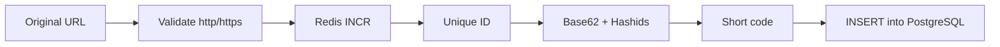

# URL Shortener

A Go CLI that shortens URLs. Redis issues a unique ID, the short code is derived from it (Base62 + Hashids), then the mapping is stored in PostgreSQL. Uniqueness never depends on checking whether a code already exists.

## Flow



The public code is not a column. It is always derived from `(id, HASHIDS_SALT)`.

## Why this design

Random short codes need a `SELECT` (is this taken?) plus a retry on collision. That check-then-act is a race, gets worse as the namespace fills, and turns the database into a uniqueness oracle — a bad shape for a critical write path.

Here Redis `INCR` issues a unique `uint64`. Encoding is deterministic, so two IDs cannot produce the same code. Create is increment, encode, insert. No existence query, no retry.

Hashids + `HASHIDS_SALT` also hide sequence. Plain Base62 would leak order (`abc`, `abd`) and let anyone enumerate stored URLs. Only `http`/`https` URLs with a host are accepted.

## Usage

Copy `env.local` to `.env` and set `POSTGRES_*` plus a long random `HASHIDS_SALT`.

```bash
make up
make migrate
make image

make shorten   # prompts for a URL, prints the code
make load-test # prompts for a URL and how many times to shorten it
make list      # lists code, timestamp, and original URL
make down
```
