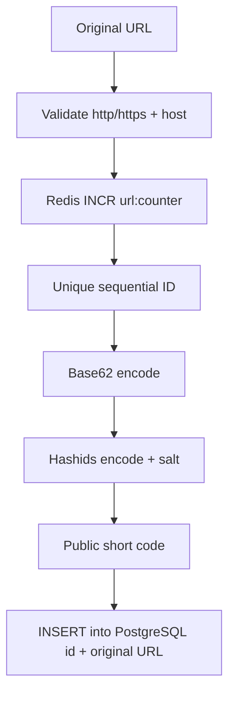
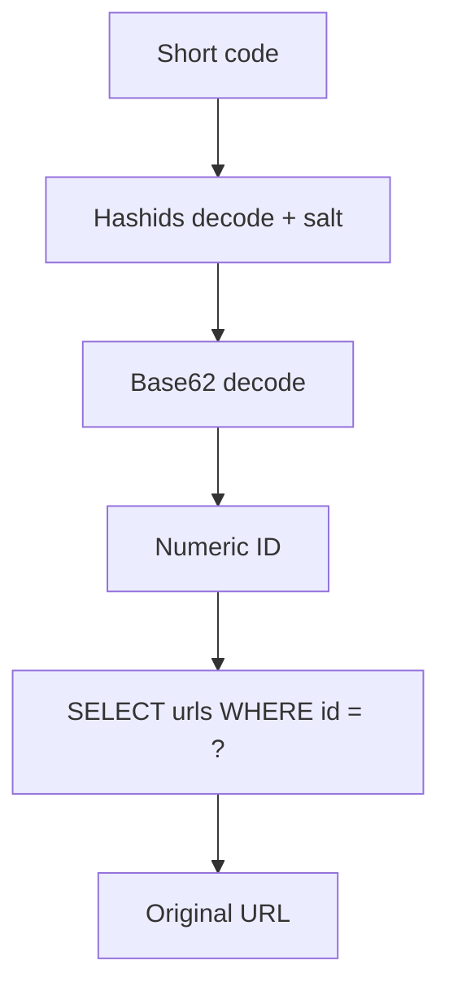

# URL Shortener

A Go URL shortener. IDs are issued atomically by Redis and turned into a public short code with Base62 + Hashids. Only then is the mapping written to PostgreSQL. The code is a pure function of the ID: uniqueness is guaranteed without asking the database whether a short code already exists.

## Flow

Creating a short URL is a one-way pipeline. Redis issues the ID, the code is derived from it, and Postgres is written last. There is no “does this code exist?” round-trip.



Resolve is the inverse. The short code is never a lookup key: it is decoded back into the numeric ID, then fetched by primary key.



The public code is not a column. It is always derived from `(id, HASHIDS_SALT)`.

## Why not generate a random short code?

The common approach is: pick a random string, `SELECT` to see if it is free, retry on collision, then `INSERT`. That is the wrong shape for a hot write path.

- **Collision checks do not scale.** As the namespace fills, collisions become more frequent. Each create pays extra queries, and under load you need a retry loop. In a critical system that extra read-before-write is wasted work and a source of tail latency.
- **Check-then-act is a race.** Two requests can both see a code as free and both try to insert it. You still need a unique constraint and a retry on conflict — the `SELECT` never made the operation safe.
- **The database becomes a uniqueness oracle.** Every shorten depends on an existence probe. That couples write throughput to index lookups and contention on the short-code unique index.

This project never asks “is this code taken?”. Redis `INCR` issues a unique `uint64`. Encoding is deterministic and injective for a given salt, so two IDs cannot produce the same code. Create is `INCR` + `INSERT` + encode. No existence query, no retry, no unique index on the code.

Anti-collision is a property of the ID generator, not a database scan.

## Security

Sequential Base62 alone would leak order: `…`, `abc`, `abd`. Anyone could walk the ID space and enumerate every stored URL.

Hashids, keyed by `HASHIDS_SALT`, breaks that correlation. Neighboring IDs become unrelated strings (`MinLength = 4`). The mapping stays reversible for the service, but not guessable for a client. The salt must stay secret and stable: a weak salt makes codes enumerable; rotating it invalidates every existing link.

Input is restricted to `http`/`https` with a host (`url.ParseRequestURI`). That rejects `javascript:`, relative URLs, and unexpected schemes before anything is stored.

## Other technical choices

### Atomic IDs in Redis

The primary key is not a Postgres `SERIAL`. A Redis counter (`INCR` on `url:counter`) produces the next value without table locks or a database sequence.

The counter is initialized at `15_000_000` with `SETNX`. The offset keeps early codes at a stable length instead of growing from one character as volume increases. Redis is the ID issuer, not a cache. PostgreSQL remains the source of truth for the URL.

### PostgreSQL as persistence

The table stays narrow:

```sql
CREATE TABLE urls (
    id BIGINT PRIMARY KEY,
    original_url TEXT NOT NULL,
    created_at TIMESTAMPTZ NOT NULL DEFAULT NOW()
);
```

`BIGINT` holds the external ID. `TEXT` stores the original URL. `TIMESTAMPTZ` avoids timezone ambiguity. An index on `created_at` covers `ORDER BY created_at DESC` for `list`.

Schema is versioned with [golang-migrate](https://github.com/golang-migrate/migrate). Queries go through [pgx](https://github.com/jackc/pgx) with no ORM.

### CLI first

The current interface is a Cobra CLI (`shorten`, `list`). Commands receive a `context.Context` cancelled on `SIGINT`/`SIGTERM`. Dependencies open for the command and close in `defer`.

An HTTP redirect server is not wired yet. Compose already reserves `shortener.local` via CoreDNS, and the image exposes `8080`.

Layout:

```
cmd/shortener     CLI entry + wiring
internal/urls     domain, rules, persistence
internal/idgen    Redis ID generator
internal/base62   compact encoding of the id
internal/hashid   public-code obfuscation
internal/db       Postgres and Redis connections
```

### Local infra

- **Postgres 18** with a `pg_isready` healthcheck. The CLI waits for a healthy database.
- **Redis 8** holds the counter on a named volume.
- **CoreDNS** resolves `shortener.local` to `127.0.0.1` and forwards everything else.
- **url** (`cli` profile) is the app binary. `make shorten` / `make list` start it, run, and exit.

The image is a multi-stage static build (`CGO_ENABLED=0`, Alpine). The Makefile wraps Compose: `migrate`, `up`, `down`, `image`, `shorten`, `list`.

## Requirements

- Docker and Docker Compose
- A `.env` file at the repo root (copy from `env.local`)

| Variable            | Role                                      |
|---------------------|-------------------------------------------|
| `POSTGRES_USER`     | Database user                             |
| `POSTGRES_PASSWORD` | Database password                         |
| `POSTGRES_DB`       | Database name                             |
| `POSTGRES_PORT`     | Published Postgres port                   |
| `REDIS_URL`         | Redis URL (`redis://redis:6379/0`)        |
| `HASHIDS_SALT`      | Hashids salt (do not commit the real one) |

## Usage

```bash
cp env.local .env
# fill POSTGRES_* and a long random HASHIDS_SALT

make up
make migrate
make image

make shorten   # prompts for a URL, prints the code
make list      # lists code, timestamp, and original URL
```

Tear down with `make down`.
