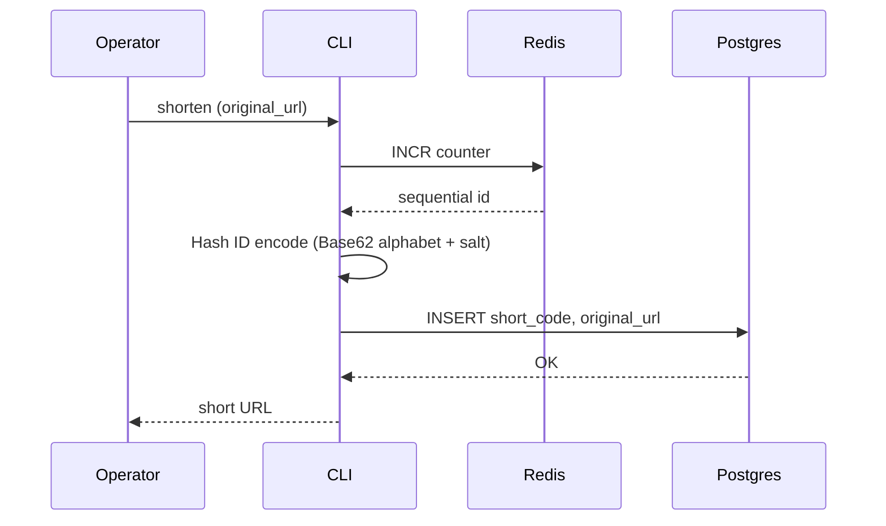
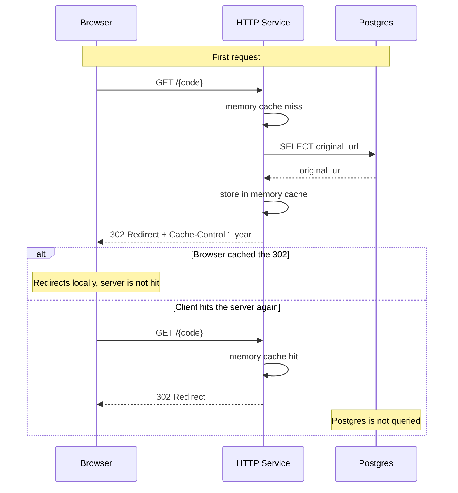

# URL Shortener

- A `CLI` written in `Go` that shortens `URL`s in a scalable, performant, and **collision-free** way.

## Flow

**1. Create**



**2. Read**



## Why this design

`Redis INCR` atomically increments a counter and returns a unique integer.
Concurrent requests cannot race and receive the same `ID`.

That `ID` is then encoded with `Hash ID` using a [Base62](https://base62.org/) alphabet and a secret salt.
The salt shuffles the encoding so sequential `IDs` do not produce sequential, guessable short codes.

Only after the code is generated is it inserted into Postgres.
Because IDs are unique by construction, **the service never queries the database to check whether a short code already exists**.
That kind of lookup would be a bottleneck and a source of contention in a distributed system.

## Usage

[Docker](https://docs.docker.com/get-docker/) is required.

Copy `env.local` to `.env` and set `POSTGRES_*`, `REDIS_URL`, and a long random `HASHIDS_SALT`.

```bash
make up
make migrate
make image

make help       # prints CLI usage
make shorten    # prompts for a URL, prints http://shortener.localhost/{code}
make load-test  # prompts for a URL and how many times to shorten it
make list       # lists the 20 most recent codes
make down       # stops containers; volumes (data) stay
```