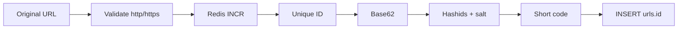
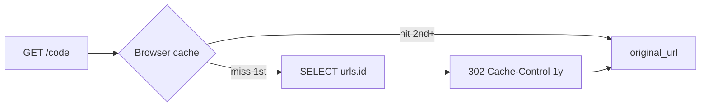

# URL Shortener

A Go CLI that shortens URLs. Redis `INCR` issues a unique `uint64` so concurrent writes cannot collide. That integer is encoded in a Base62 alphabet, then Hashids + `HASHIDS_SALT` turns **that same one ID** into the public short code stored as `urls.id`. Uniqueness never depends on checking whether a code already exists.

`GET /{code}` looks the code up by primary key and returns `302 Found` with a one-year `Cache-Control`. The first visit hits Postgres (or the in-process cache); later visits are served from the browser cache and never reach the server.

## Flow

**Create**



**Read**



`urls.id` is the short code. Redis never writes to Postgres; it only allocates the next integer. Create is Redis → Base62 alphabet → Hashids + salt, always on **one** `uint64`. Hashids does not encode each Base62 character as a separate number — that would only make the code longer. Read does not decode: it looks up the path code as primary key. Redis, Base62, and Hashids are not on the resolve path. `serve` opens Postgres only.

## Layout

```
cmd/shortener/      CLI (Cobra), HTTP serve, and composition root
internal/urls/      validate, encode, persist, resolve
internal/idgen/     Redis INCR — unique uint64
internal/base62/    Base62 alphabet (compact form of the unique ID)
internal/hashid/    that one uint64 → short code (Hashids + HASHIDS_SALT)
internal/postgres/  connection pool
migrations/         golang-migrate SQL
```

`cmd/shortener` wires the process: it opens a Postgres pool, dials Redis through `idgen` for writes, and builds `urls.Service`. Redis is owned by `idgen`. Postgres is owned by the URL repository. Neither package knows about the other.

## Why this design

Random short codes need a `SELECT` (is this taken?) plus a retry on collision. That check-then-act is a race and turns the database into a uniqueness oracle.

Here Redis `INCR` issues a unique `uint64`. That ID is encoded with a Base62 alphabet, then Hashids + `HASHIDS_SALT` so sequential IDs do not leak as sequential codes (`abc`, `abd`). Both steps operate on the same integer. Encoding is deterministic: two IDs cannot produce the same code. Create is increment, Base62, Hashids, insert. No existence query, no retry.

Only `http`/`https` URLs with a host are accepted.

## Usage

Copy `env.local` to `.env` and set `POSTGRES_*`, `REDIS_URL`, and a long random `HASHIDS_SALT`.

```bash
make up
make migrate
make image

make shorten    # prompts for a URL, prints http://shortener.localhost/{code}
make load-test  # prompts for a URL and how many times to shorten it
make list       # lists the 50 most recent codes
make down       # stops containers; volumes (data) stay
```

`make image` builds the binary; `make up` starts it. `shorten` / `load-test` / `list` exec into the running container. To wipe Postgres and Redis:

```bash
docker compose down -v
make up
make migrate
```

Open the printed URL. Browsers resolve `*.localhost` to this machine with no hosts file. The HTTP service listens on port 80 and responds with `302` to the original URL.
