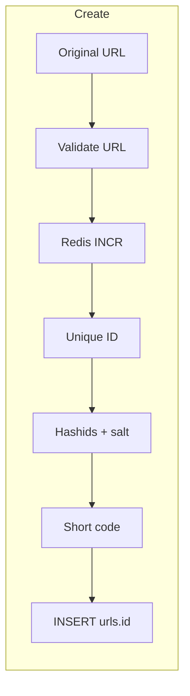
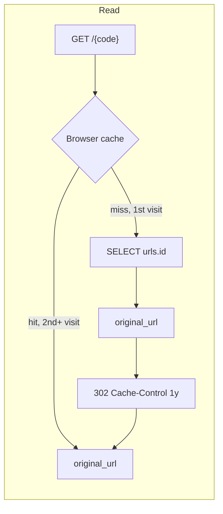

# URL Shortener

A Go CLI that shortens URLs. Redis issues a unique numeric ID to avoid collisions under concurrency. That ID is encoded with Hashids + salt and the resulting short code is stored as `urls.id`. Uniqueness never depends on checking whether a code already exists. `GET /{code}` looks the code up by primary key and returns `302 Found` with a one-year `Cache-Control`, so browsers and the in-process cache skip Postgres on later hits.

## Flow





`urls.id` is the short code. Redis never writes to Postgres; it only allocates the next integer. Hashids encodes that `uint64` directly — there is no Base62 step. Read does not decode: it looks up the path code as primary key and returns `302` with a one-year `Cache-Control`. The first visit hits Postgres; later visits are served from the browser cache and never reach the server. Redis and Hashids are not on the resolve path.

## Layout

```
cmd/shortener/      CLI (Cobra), HTTP serve, and composition root
internal/urls/      domain: validate, encode, persist, resolve
internal/idgen/     Redis INCR — unique uint64, nothing else
internal/hashid/    uint64 → short code (Hashids + HASHIDS_SALT)
internal/postgres/  connection pool
migrations/         golang-migrate SQL
```

`cmd/shortener` wires the process: it opens a Postgres pool, dials Redis through `idgen` for writes, and builds `urls.Service`. Redis is owned by `idgen`. Postgres is owned by the URL repository. Neither package knows about the other. `serve` opens Postgres only.

## Why this design

Random short codes need a `SELECT` (is this taken?) plus a retry on collision. That check-then-act is a race, gets worse as the namespace fills, and turns the database into a uniqueness oracle — a bad shape for a critical write path.

Here Redis `INCR` issues a unique `uint64`. Encoding is deterministic, so two IDs cannot produce the same code. Create is increment, encode, insert. No existence query, no retry.

Hashids + `HASHIDS_SALT` also hide sequence. Encoding the integer as Base62 would leak order (`abc`, `abd`) and let anyone enumerate stored URLs. Only `http`/`https` URLs with a host are accepted.

## Usage

Copy `env.local` to `.env` and set `POSTGRES_*`, `REDIS_URL`, and a long random `HASHIDS_SALT`.

```bash
make up
make migrate
make image

make shorten   # prompts for a URL, prints http://shortener.localhost/{code}
make load-test # prompts for a URL and how many times to shorten it
make list      # lists the 50 most recent codes
make down
```

Open the printed URL. Browsers resolve `*.localhost` to this machine with no hosts file. The HTTP service listens on port 80 and responds with `302` to the original URL.
